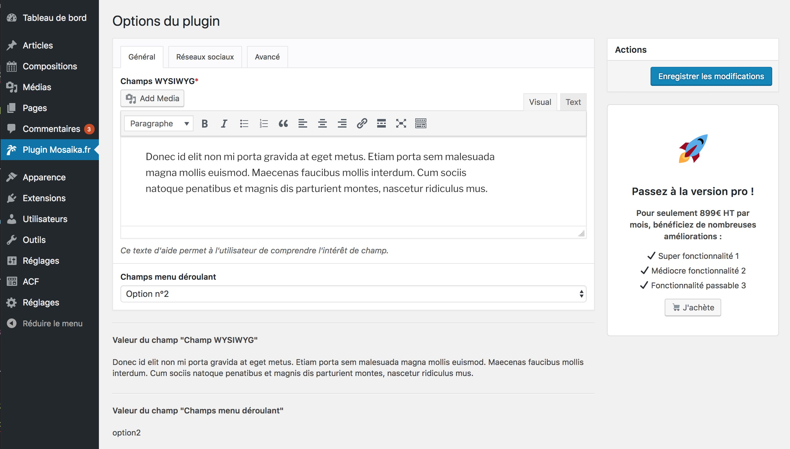

# Plugin avec page d'options Carbon Fields
### Principe général
Ce plugin créée une page d'options en utilisant [la librairie Carbon Fields](https://carbonfields.net/). Il a pour seul but d'expliquer l'utilisation de cette librairie pour ajouter une page de réglages à une extension WordPress, et ce de manière flexible en utilisant les hooks WordPress.

#### Fonctionnalités
- Il ajoute 4 onglets via un filtre.
- Les champs de chaque onglet sont chargés via un filtre.
- Un espace promotionnel est affiché dans la barre latérale de la page d'options.
- La valeur de l'option _Champ WYSIWYG_ est affiché sous la metabox d'onglets.

### Capture d'écran

### En savoir plus
Tutoriel complet disponible sur [Mosaika.fr](https://mosaika.fr/options-plugin-wordpress-carbonfields)
